# CCoE Resolution Metrics Flow Diagram

```mermaid
flowchart TD
    A[PagerDuty API] --> B[Custom Fields Endpoint]
    B --> |"field_name: 'resolution'<br/>field_value: 'ccoe'"| C[Client: get_incident_custom_fields]
    
    C --> D[Client: convert_to_incident_object]
    D --> |"resolved_by_ccoe = resolution.lower() == 'ccoe'"| E[Incident Object]
    
    E --> |"resolved_by_ccoe: bool"| F[Database: store_incident]
    F --> |"SQLite incidents table"| G[(Database Storage)]
    
    G --> H[Analytics: get_ccoe_resolved_incidents_last_x_days]
    H --> |"COUNT(*) WHERE resolved_by_ccoe = 1"| I[SQL Aggregation]
    
    G --> J[Analytics: get_service_metrics_last_x_days]
    J --> |"SUM(CASE WHEN resolved_by_ccoe = 1)"| K[Per-Service Metrics]
    
    I --> L[Flask API: /api/service/summary]
    K --> L
    L --> |"JSON: ccoe_resolved_incidents"| M[Web Dashboard]
    
    M --> N[UI: Summary Card Display]
    N --> O[👤 User sees CCoE count]
    
    style A fill:#e1f5fe
    style G fill:#f3e5f5
    style M fill:#e8f5e8
    style O fill:#fff3e0
    
    classDef apiNode fill:#e1f5fe,stroke:#0277bd
    classDef dataNode fill:#f3e5f5,stroke:#7b1fa2
    classDef uiNode fill:#e8f5e8,stroke:#388e3c
    classDef processNode fill:#fff8e1,stroke:#f57c00
    
    class A,B apiNode
    class G dataNode
    class M,N,O uiNode
    class C,D,E,F,H,I,J,K,L processNode
```



## Data Flow Steps:

### 🔄 **Data Collection Phase**
1. **PagerDuty API Call** → Custom fields endpoint for each incident
2. **Field Extraction** → Looks for 'resolution' field with value 'ccoe'
3. **Data Processing** → Converts string to boolean flag

### 💾 **Data Storage Phase**
4. **Object Creation** → Incident object with `resolved_by_ccoe` boolean
5. **Database Insert** → SQLite storage with boolean column

### 📊 **Analytics Phase**
6. **Aggregation Queries** → SQL COUNT/SUM operations
7. **Service Metrics** → Per-service breakdowns
8. **Time-based Filtering** → Date range calculations

### 🖥️ **Presentation Phase**
9. **API Response** → JSON with CCoE metrics
10. **UI Update** → Dashboard displays the count
11. **User Interface** → Visual metric cards and calendar

## Key Decision Points:

- **String Matching**: `resolution.lower() == 'ccoe'` (case-insensitive)
- **Null Handling**: `resolution and resolution.lower() == 'ccoe'` (prevents None errors)
- **Boolean Storage**: Stored as 1/0 in SQLite for efficient querying
- **Time Filtering**: Uses incident `created_at` date for period calculations

## Metric Calculation Formula:
```sql
COUNT(*) WHERE resolved_by_ccoe = 1 AND DATE(created_at) BETWEEN start_date AND end_date
```